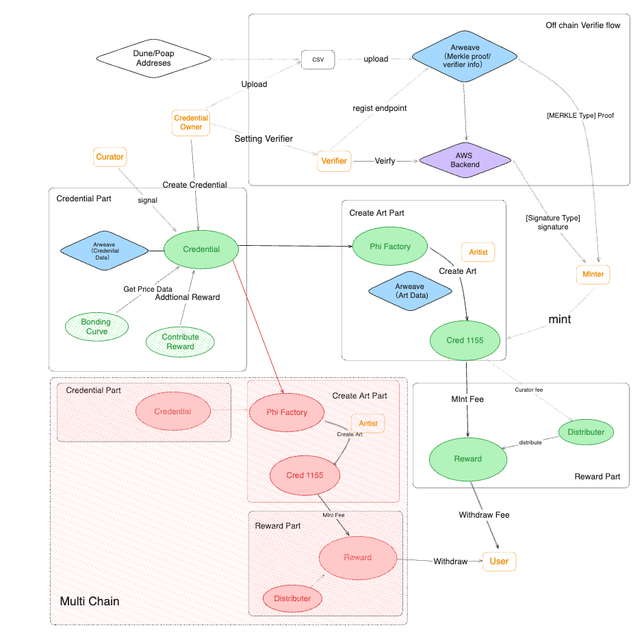
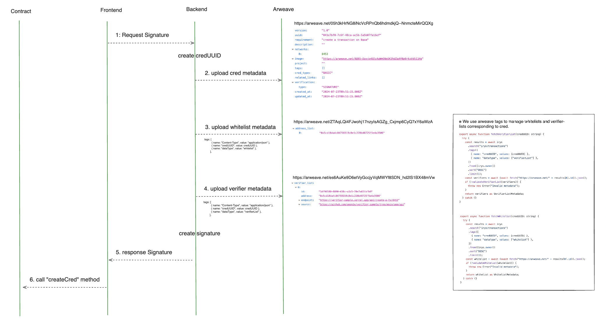
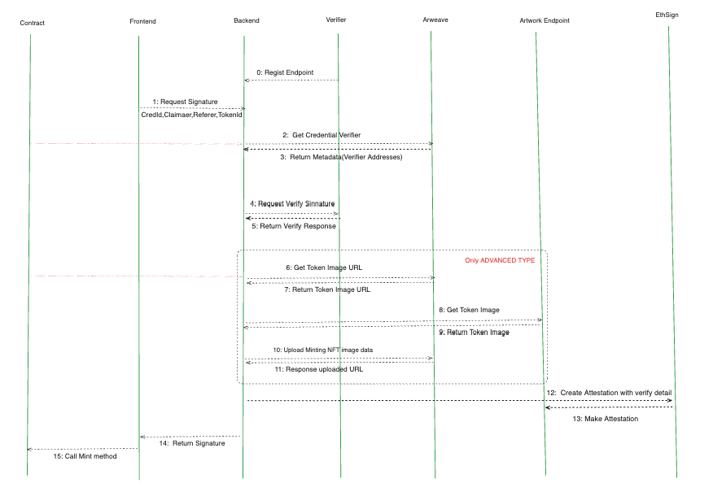

# Phi Protocol Documentation

## Overview

Phi Protocol is a protocol for issuing and managing credentials on-chain and issuing NFTs linked to those creds. Cred
creators define creds by setting conditions, and users can obtain NFTs by meeting those conditions. Also, we are also
developing mint dapps based on this protocol layer.

## Architecture

Phi Protocol consists of the following main contracts:

1. **Cred**: Manages credential data.
2. **PhiFactory**: Manages the creation of NFTs.
3. **PhiNFT1155**: Manages NFTs representing credentials.
4. **PhiRewards**: Manages the distribution of rewards.
5. **BondingCurve**: Manages the bonding curve for credentials.
6. **CuratorRewardsDistributor**: Manages the distribution of curator rewards.
7. **ContributeRewards**: Manages additional rewards for credentials. (not audit scope)

## Credential Creation

To create a credential, follow these steps:

1. Call the `createCred` function of the Cred contract, specifying the credential URL, verification type, bonding curve
   address, etc.
2. Credential data is stored in the Cred contract, and a new credential ID is issued.

### signature creation flow 

## NFT Creation and Claiming

To create NFTs linked to credentials, follow these steps:

1. Call the `createArt` function of the PhiFactory contract, passing the signed data and creation settings.
2. The PhiFactory contract deploys a new PhiNFT1155 contract or uses an existing contract to create NFTs.

Users can call the `merkleClaim` or `signatureClaim` function of the PhiFactory contract to claim NFTs if they meet the
conditions. 3. Each PhiNFT1155 contracts also have `merkleClaim` and `signatureClaim`. You can check this method in
Claimable.sol

## Additional Rewards

Using the ContributeRewards contract, additional rewards can be set for credentials.

1. Call the `setRewardInfo` function, specifying the cred ID, reward information (claim deadline, Merkle root, reward
   tokens, etc.).
2. Users can call the `claimReward` function, providing the Merkle proof to claim rewards.

## shareing (Curating) and Curator Rewards

Users can send shares to credentials by calling the `buyShareCred` function of the Cred contract. shareing requires ETH
calculated by the bonding curve. To cancel a share, use the `sellShareCred` function.

[Price Curve](https://docs.google.com/spreadsheets/d/18wHi9Mqo9YU8EUMQuUvuC75Dav6NSY5LOw-iDlkrZEA/edit?gid=859106557#gid=859106557)

Curators can call the `distribute` function of the CuratorRewardsDistributor contract to receive rewards based on the
amount of shares they hold.

## Reward Distribution

The PhiRewards contract manages the distribution of rewards to artists, referrers, and verifiers. The reward amounts are
defined in the contract's storage variables and can be updated by the owner.

## Upgradeability

The Cred, PhiFactory, and PhiNFT1155 contracts use the UUPS upgradeability pattern and can be upgraded by the owner.

## Base Fee

- NFTs can be minted for 0.00030ETH.
- There is no protocol fee paid to the Phi Protocol when creating an NFT.

## Minting Conditions

To mint, certain conditions must be met. There are two types of conditions: MERKLE type and SIGNATURE type. Each type
has a different Verifier address:

- **MERKLE Type**: The verifier address is the Credential Creator.

  - https://github.com/PHI-LABS-INC/dune-csv-export

- **SIGNATURE Type**: The verifier address is the Verifier hosting the backend.
  - https://github.com/PHI-LABS-INC/verifier-template

### signature creation flow 

signature verify flow⭐️ https://gist.github.com/ZaK3939/f4b17335ec03fb0af57c26627885ca16

## Basic vs Advanced

Regarding "Basic" and "Advanced", the difference lies in what they verify. The former determines true/false for
requirements, while the latter involves the verifier checking the number of swaps in a specific contract, ETH balance,
or some other message against the requirements.

## Mint Fee

In addition to the base cost of 0.00030ETH, a paid mint fee can be set. The entire amount of this paid mint fee is
received by the artist.

## Reward Distribution Scenarios

### 5.1 Free Mint without Referral

- Artist Reward: 0.00015ETH
- Verifier Reward: 0.00005ETH
- Curator Reward: 0.00005ETH
- Phi Protocol Fee: 0.00005ETH
- Total: 0.00030ETH

### Free Mint with Referral

- Artist Reward: 0.0001ETH
- Mint Referral Reward: 0.00005ETH
- Verifier Reward: 0.00005ETH
- Curator Reward: 0.00005ETH
- Phi Protocol Fee: 0.00005ETH
- Total: 0.00030ETH

### Paid Mint without Referral

- Artist Reward: paid fee + 0.00015ETH
- Verifier Reward: 0.00005ETH
- Curator Reward: 0.00005ETH
- Phi Protocol Fee: 0.00005ETH
- Total: 0.00030ETH

### Paid Mint with Referral

- Artist Reward: paid fee + 0.0001ETH
- Mint Referral Reward: 0.00005ETH
- Verifier Reward: 0.00005ETH
- Curator Reward: 0.00005ETH
- Phi Protocol Fee: 0.00005ETH
- Total: 0.00030ETH

### 5.2 Cred and NFT Contract Compatibility

The distribution of the Curator reward depends on the compatibility between the cred and the NFT contract:

- If the cred is created on the Base chain and the NFT is also created on the Base chain, the Curator reward goes to the
  Curator.
- If the NFT is created on a different chain than the cred, the Curator reward goes to the Artist.

### 5.3 Rewards Deposit and Withdrawal

The rewards for each stakeholder, except the protocol, can be deposited into the PhiReward contract on the chain where
the profit was generated. You can check `abstract/RewardControl.sol` and `PhiRewards.sol`.

When withdrawing, it is possible to withdraw from a different chain with the support of the RelayProtocol.

### 5.4 Curator Reward Distribution

The curator rewards system allows users to receive rewards based on the number of shares associated with a specific Cred
id. Here are the main points of the curator reward processing: Reward Distribution (Distribute)

1.Balance Check: Ensure that there is a total balance associated with the specified Cred ID.

2.Retrieving Curator Addresses: Use credContract.getCuratorAddresses to obtain the curator addresses associated with the
specified Cred ID.

3.share Count Calculation: Calculate the number of shares for each curator address and determine the total number of
shares at the current time.

4.Exxecutor Royalty Calculation: Calculate the distribution amount by subtracting the royalty fee (1%) from the total
balance.

5.Royalty Payment to Triggering User: If royalties are generated, the royalties are paid to the user who triggered the
distribution.

6.Individual Reward Calculation: Calculate the rewards each curator should receive based on their number of shares.

7.Reward Distribution: Distribute the calculated rewards to each curator and deposit them into the Phi Rewards contract.

In this way, curators receive rewards based on their shares, and the user who triggers the reward distribution earns the
royalty. The reward calculation is based on the current number of shares for each curator.

## NFT Royalties

NFT royalties are managed with the identifier 2981. Generally, a 5% royalty is set and is expected to flow to the
protocol. Please check `abstract/CreatorRoyaltiesControl.sol`

## Credential Creators

### 7.1 Credential Creators

Credential creators, referred to as Creators, earn rewards by performing MERKLE type verification or by acting as
Verifiers for SIGNATURE type verification.

### 7.2 share Royalty

They also receive royalties from buying and selling shares. These royalties are sent directly to their address and do
not require withdrawal from the reward contract. The protocol's royalty fee for shares buy/sell is set at 5%.

### 7.3 Cred Creating Fee

When creating a credential, the cost includes purchasing one share.

## Additional Reward Distribution

In cases where additional grants or distributions are made, the recipient, the token to be distributed, and the amount
can be specified. This allows for rewards to be distributed to minters and others as specified.

## Multi-Chain Deployment

These contracts are planned to be deployed on multiple chains.

## Other resources

- https://github.com/PHI-LABS-INC/phi-resources
- Gitbook, Notion, Figma

---

This README provides a detailed overview of the Phi Protocol, including its architecture, processes for creating
credentials and NFTs, reward distribution mechanisms, and more. The diagrams and additional contracts offer further
insights into the protocol's functionality and implementation.
